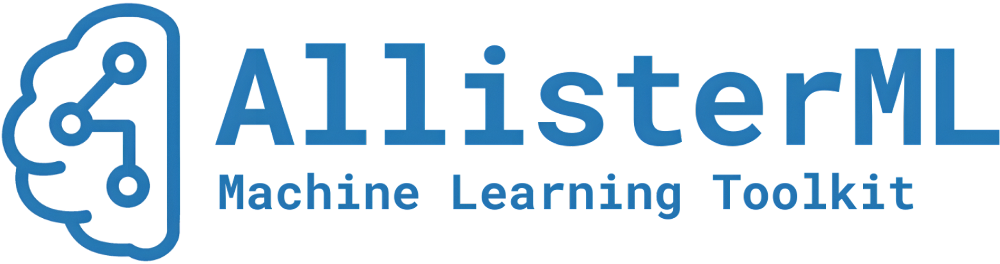

  

## AllisterML

**AllisterML** is a modular, extensible, and configuration-driven framework for training, evaluating, and tracking machine learning models.  
It is designed to make ML experimentation reproducible, organized, and production-ready, while allowing full flexibility in dataset preprocessing, model selection, hyperparameter tuning, and experiment logging.

#### 📬 Contact
- **Name:** Allister Kohn  
- **Email:** allister.kohn@gmail.com
- **LinkedIn:** [linkedin.com/in/allisterkohn](https://www.linkedin.com/in/allisterkohn/)

___